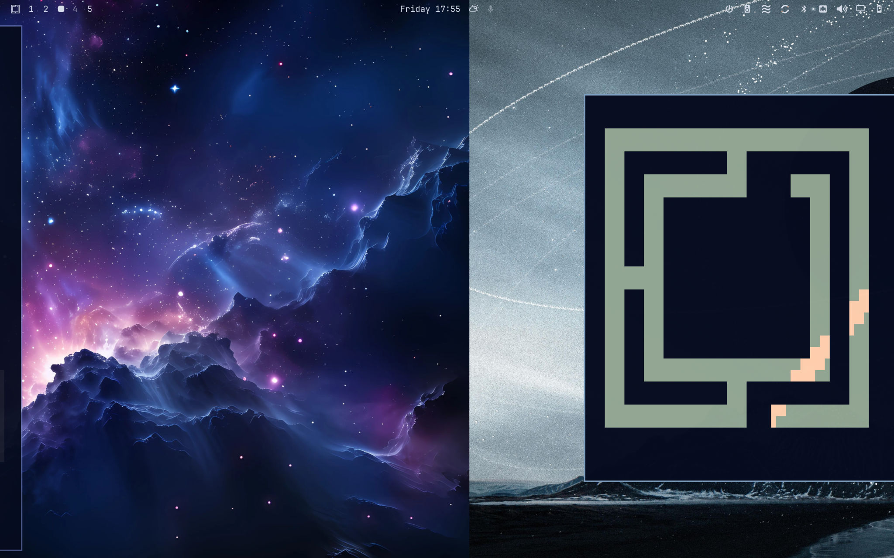

# Omaswipe



Omaswipe is a Omarchy plugin that allows you to 3-finger swipe with compatible macs between your Omarchy workspaces. Incidentally this also by default enables you to change the themes and backgrounds of all workspaces individually. Enjoy.

---

# AI written

## Install

```sh
omarchy plugin add https://github.com/LessUnderRated/OmaSwipe.git --enable
```

## Usage

Three-finger horizontal swipe changes workspaces. Hold mid-swipe and the wallpaper stays with the windows.

## Configure

Assignments are saved in `~/.config/omarchy/omaswipe.json`.

## Remove

```sh
omarchy plugin remove omaswipe
```

